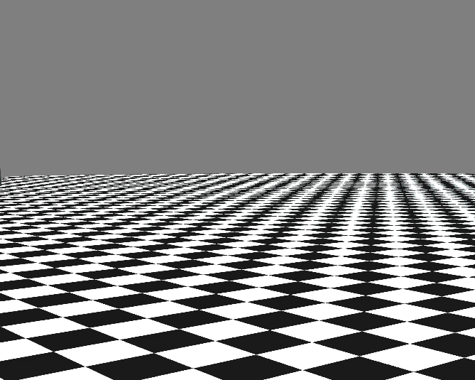

# Radi
A simple 2D & 3D Renderer built with OpenGL
## Scene 3 rendered

## Scene 4 rendered

## Depth of Field

## Motion Blur

## Strattified Jittering 1 sample 

## Strattified Jittering 4 samples

And of course all of this is running inside a single fragment shader i.e. parallel